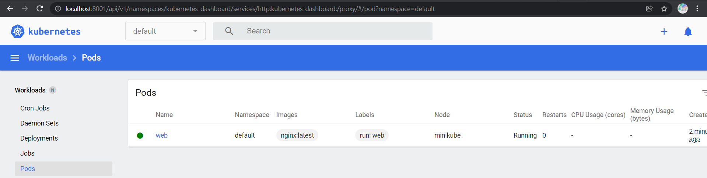
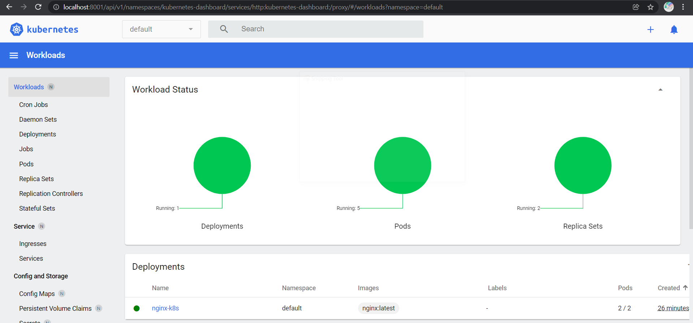
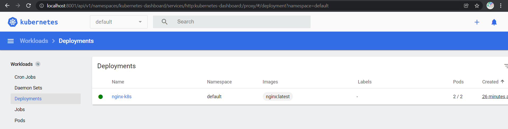
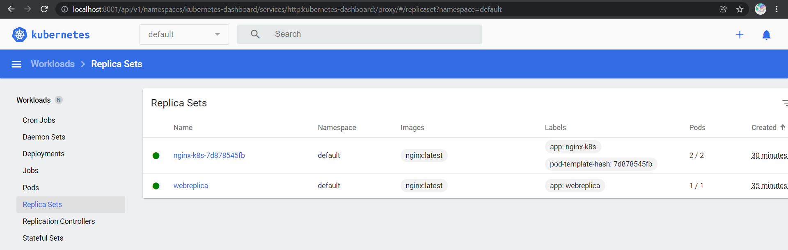
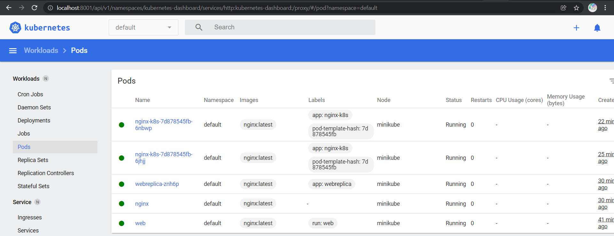

# General info
The first part in this readme contains some test and exploratory / curiosity commands.  
The `Homework` itself down below, here is the link right to it: [the Homework ](#homework)

# Task 1.1
## Verify kubectl installation
```
tsar@DESKTOP-80THIFC:Homework05_K8s$ k version --client  
Client Version: version.Info{Major:"1", Minor:"22", GitVersion:"v1.22.4",  
GitCommit:"b695d79d4f967c403a96986f1750a35eb75e75f1", GitTreeState:"clean",  
BuildDate:"2021-11-17T15:48:33Z", GoVersion:"go1.16.10", 
Compiler:"gc", Platform:"linux/amd64"}

tsar@DESKTOP-80THIFC:Homework05_K8s$ minikube.exe status
minikube
type: Control Plane
host: Running
kubelet: Running
apiserver: Running
kubeconfig: Configured

tsar@DESKTOP-80THIFC:Homework05_K8s$ k cluster-info
Kubernetes control plane is running at https://127.0.0.1:55158
CoreDNS is running at https://127.0.0.1:55158/api/v1/namespaces/kube-system/services/kube-dns:dns/proxy

To further debug and diagnose cluster problems, use 'kubectl cluster-info dump'.

tsar@DESKTOP-80THIFC:Homework05_K8s$ k get nodes
NAME       STATUS   ROLES                  AGE   VERSION
minikube   Ready    control-plane,master   35d   v1.22.3
```

## Kubernetes Dashboard
```
k get pod -n kubernetes-dashboard
> NAME                                         READY   STATUS    RESTARTS        AGE
> dashboard-metrics-scraper-5594458c94-f9bsf   1/1     Running   9 (2d8h ago)    35d
> kubernetes-dashboard-654cf69797-hthbt        1/1     Running   28 (2d8h ago)   35d
```


## Metrics server
```
k get deploy,po -n kube-system -l k8s-app=metrics-server
> NAME                             READY   UP-TO-DATE   AVAILABLE   AGE
> deployment.apps/metrics-server   1/1     1            1           72m
> 
> NAME                                  READY   STATUS    RESTARTS   AGE
> pod/metrics-server-5794ccf74d-65zhd   1/1     Running   0          69m

k top pod -n kube-system metrics-server-5794ccf74d-65zhd
> NAME                              CPU(cores)   MEMORY(bytes)
> metrics-server-5794ccf74d-65zhd   7m           22Mi
```

# Task 1.2
## Kubernetes resources introduction
```
tsar@DESKTOP-80THIFC:Homework05_K8s$ k run web --image=nginx:latest
tsar@DESKTOP-80THIFC:Homework05_K8s$ k get pods
> NAME   READY   STATUS    RESTARTS   AGE
> web    1/1     Running   0          3m39s

tsar@DESKTOP-80THIFC:Homework05_K8s$ minikube.exe ssh
> Last login: Fri Dec 24 17:03:53 2021 from 192.168.49.1

docker@minikube:~$ docker container ls
> CONTAINER ID   IMAGE                  COMMAND                  CREATED         STATUS         PORTS
>                  NAMES
> 08ccd1be3f91   nginx                  "/docker-entrypoint.…"   4 minutes ago   Up 4 minutes
>                  k8s_web_web_default_bc50d753-81f6-4d21-a794-626a4ac0e4ca_0
> 953b517bc457   k8s.gcr.io/pause:3.5   "/pause"                 5 minutes ago   Up 5 minutes
>                  k8s_POD_web_default_bc50d753-81f6-4d21-a794-626a4ac0e4ca_0
> 10a99812d187   5787924fe1d8           "/metrics-server --c…"   3 hours ago     Up 3 hours
>                  k8s_metrics-server_metrics-server-5794ccf74d-65zhd_kube-system_f877edca-2a62-4909-b5fa-a11dfc33fe01_0
> 1e39c4275ac8   k8s.gcr.io/pause:3.5   "/pause"                 3 hours ago     Up 3 hours
>                  k8s_POD_metrics-server-5794ccf74d-65zhd_kube-system_f877edca-2a62-4909-b5fa-a11dfc33fe01_0
> 8e54a0a451f1   6e38f40d628d           "/storage-provisioner"   4 hours ago     Up 4 hours
```


## [Specification](https://kubernetes.io/docs/reference/generated/kubernetes-api/v1.18/)
```
tsar@DESKTOP-80THIFC:task_1$ k get po
> NAME               READY   STATUS    RESTARTS   AGE
> nginx              1/1     Running   0          43s
> web                1/1     Running   0          11m
> webreplica-znh6p   1/1     Running   0          42s
```

# Homework
Contents of the `deploy-nginx.yaml` 
```
apiVersion: apps/v1
kind: Deployment
metadata:
  name: nginx-k8s
spec:
  replicas: 2
  selector:
    matchLabels:
      app: nginx-k8s
  template:
    metadata:
      labels:
        app: nginx-k8s # the label for the pods and the deployments
    spec:
      containers:
      - name: nginx-k8s
        image: nginx:latest
        imagePullPolicy: Always
        ports:
        - containerPort: 80 # the application listens to this port
        resources:
          requests: # minimum resources required
            cpu: 250m
            memory: 64Mi
          limits: # maximum resources allocated
            cpu: 500m
            memory: 512Mi
```
Deploying
```
tsar@DESKTOP-80THIFC:task_1$ k apply -f ./deploy-nginx.yaml
> deployment.apps/nginx-k8s created

tsar@DESKTOP-80THIFC:task_1$ k get po -l app=nginx-k8s
> NAME                         READY   STATUS    RESTARTS   AGE
> nginx-k8s-7d878545fb-4b525   1/1     Running   0          21s
> nginx-k8s-7d878545fb-6jhjj   1/1     Running   0          21s
```
Removing one of the pods
```
tsar@DESKTOP-80THIFC:task_1$ k delete po nginx-k8s-7d878545fb-4b525
> pod "nginx-k8s-7d878545fb-4b525" deleted
```
A new one immediately gets deployed, in place of the stopped one.
```
tsar@DESKTOP-80THIFC:task_1$ k get po -l app=nginx-k8s
> NAME                         READY   STATUS              RESTARTS   AGE
> nginx-k8s-7d878545fb-6jhjj   1/1     Running             0          3m9s
> nginx-k8s-7d878545fb-6nbwp   0/1     ContainerCreating   0          4s

tsar@DESKTOP-80THIFC:task_1$ k get po -l app=nginx-k8s
> NAME                         READY   STATUS    RESTARTS   AGE
> nginx-k8s-7d878545fb-6jhjj   1/1     Running   0          3m22s
> nginx-k8s-7d878545fb-6nbwp   1/1     Running   0          17s
```





# Snippets
```
grep -r --include \*.md alias <some_path>
cat ~/.bashrc | grep kubectl
> source <(kubectl completion bash)
cat ~/.bashrc | grep bash_alias
> # ~/.bash_aliases, instead of adding them here directly.
> if [ -f ~/.bash_aliases ]; then
>     . ~/.bash_aliases
cat ~/.bash_aliases
> alias k='kubectl'
> alias kd='kubectl describe'
k config get-contexts
echo "C:\Users\admin\.minikube\ca.crt" | sed "s/\\\/\//"
```

## Deploying metrics server
```
k apply -f https://github.com/kubernetes-sigs/metrics-server/releases/latest/download/components.yaml
k edit -n kube-system deployment metrics-server
> add - --kubelet-insecure-tls
k get deploy,po -n kube-system
k logs --namespace=kube-system pod/metrics-server-5794ccf74d-65zhd
k top pod -n kube-system metrics-server-5794ccf74d-65zhd
> NAME                              CPU(cores)   MEMORY(bytes)
> metrics-server-5794ccf74d-65zhd   7m           22Mi
k proxy
kubectl explain pods.spec
kubectl run web --image=nginx:latest --dry-run=client -o yaml # Creating a simple manifest from cmd
```

```
tsar@DESKTOP-80THIFC:task_2$ kubectl proxy
Starting to serve on 127.0.0.1:8001
```

> Use `http` in front of the service name  
> http://localhost:8001/api/v1/namespaces/kubernetes-dashboard/services/http:kubernetes-dashboard:/proxy/  
> Using `https` like this  
> http://localhost:8001/api/v1/namespaces/kubernetes-dashboard/services/https:kubernetes-dashboard:/proxy/  
> throws `error trying to reach service: tls: first record does not look like a TLS handshake` error


## Get metrics token
### Manual
```bash
kubectl describe sa -n kube-system default
# copy token name
kubectl get secrets -n kube-system
kubectl get secrets -n kube-system token_name_from_first_command -o yaml
echo -n "token_from_previous_step" | base64 -d
```
### Manual in one command
```bash
 kubectl get secrets -n kube-system $(kubectl describe sa -n kube-system default|grep Tokens|awk '{print $2}') -o yaml|grep -E "^[[:space:]]*token:"|awk '{print $2}'|base64 -d
```

### Auto
```bash
export SECRET_NAME=$(kubectl get sa -n kube-system default -o jsonpath='{.secrets[0].name}')
export TOKEN=$(kubectl get secrets -n kube-system $SECRET_NAME -o jsonpath='{.data.token}' | base64 -d)
echo $TOKEN
```

