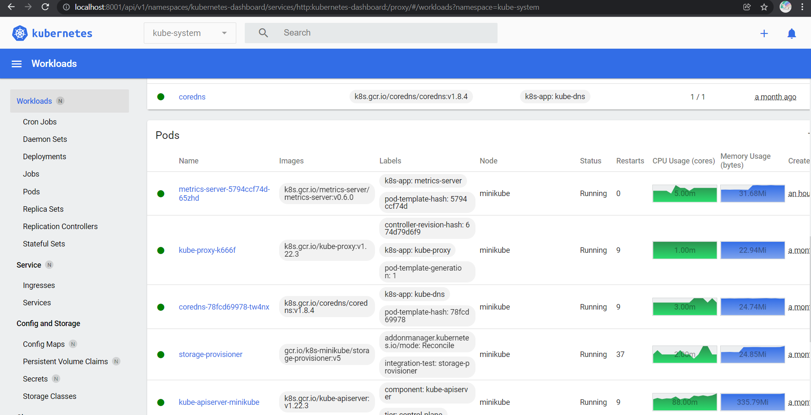

# Task 1.1
Requirements:
- [Kubectl](https://kubernetes.io/docs/tasks/tools/install-kubectl/)
- [VirtualBox](https://www.virtualbox.org/wiki/Downloads)
- [Minikube](https://minikube.sigs.k8s.io/docs/start/)
## Verify kubectl installation
```
tsar@DESKTOP-80THIFC:Homework05_K8s$ kubectl version --client
Client Version: version.Info{Major:"1", Minor:"22", GitVersion:"v1.22.4", GitCommit:"b695d79d4f967c403a96986f1750a35eb75e75f1", GitTreeState:"clean", BuildDate:"2021-11-17T15:48:33Z", GoVersion:"go1.16.10", Compiler:"gc", Platform:"linux/amd64"}

tsar@DESKTOP-80THIFC:Homework05_K8s$ minikube.exe status
minikube
type: Control Plane
host: Running
kubelet: Running
apiserver: Running
kubeconfig: Configured

tsar@DESKTOP-80THIFC:Homework05_K8s$ kubectl cluster-info
Kubernetes control plane is running at https://127.0.0.1:55158
CoreDNS is running at https://127.0.0.1:55158/api/v1/namespaces/kube-system/services/kube-dns:dns/proxy

To further debug and diagnose cluster problems, use 'kubectl cluster-info dump'.

tsar@DESKTOP-80THIFC:Homework05_K8s$ k get nodes
NAME       STATUS   ROLES                  AGE   VERSION
minikube   Ready    control-plane,master   35d   v1.22.3
```

## Kubernetes Dashboard
```
kubectl get pod -n kubernetes-dashboard
> NAME                                         READY   STATUS    RESTARTS        AGE
> dashboard-metrics-scraper-5594458c94-f9bsf   1/1     Running   9 (2d8h ago)    35d
> kubernetes-dashboard-654cf69797-hthbt        1/1     Running   28 (2d8h ago)   35d
```


## Metrics server
```
k get deploy,po -n kube-system -l k8s-app=metrics-server
> NAME                             READY   UP-TO-DATE   AVAILABLE   AGE
> deployment.apps/metrics-server   1/1     1            1           72m
> 
> NAME                                  READY   STATUS    RESTARTS   AGE
> pod/metrics-server-5794ccf74d-65zhd   1/1     Running   0          69m

kubectl top pod -n kube-system metrics-server-5794ccf74d-65zhd
> NAME                              CPU(cores)   MEMORY(bytes)
> metrics-server-5794ccf74d-65zhd   7m           22Mi
```

# Task 1.2
# Kubernetes resources introduction
```bash
kubectl run web --image=nginx:latest
```
- take a look at created resource in cmd "kubectl get pods"
- take a look at created resource in Dashboard
- take a look at created resource in cmd
```bash
minikube ssh
docker container ls
```

## [Specification](https://kubernetes.io/docs/reference/generated/kubernetes-api/v1.18/)
```bash
kubectl explain pods.spec
```
Apply manifests (download from repository)
```bash
kubectl apply -f pod.yaml
kubectl apply -f rs.yaml
```
Look at pod
```bash
kubectl get pod
```
# You can create simple manifest from cmd
```bash
kubectl run web --image=nginx:latest --dry-run=client -o yaml
```
### Homework
* Create a deployment nginx. Set up two replicas. Remove one of the pods, see what happens.

# Snippets
```
grep -r --include \*.md alias <some_path>
cat ~/.bashrc | grep kubectl
> source <(kubectl completion bash)
cat ~/.bashrc | grep bash_alias
> # ~/.bash_aliases, instead of adding them here directly.
> if [ -f ~/.bash_aliases ]; then
>     . ~/.bash_aliases
cat ~/.bash_aliases
> alias k='kubectl'
> alias kd='kubectl describe'
kubectl config get-contexts
echo "C:\Users\admin\.minikube\ca.crt" | sed "s/\\\/\//"
```

## Deploying metrics server
```
kubectl apply -f https://github.com/kubernetes-sigs/metrics-server/releases/latest/download/components.yaml
kubectl edit -n kube-system deployment metrics-server
> add - --kubelet-insecure-tls
k get deploy,po -n kube-system
kubectl logs --namespace=kube-system pod/metrics-server-5794ccf74d-65zhd
kubectl top pod -n kube-system metrics-server-5794ccf74d-65zhd
> NAME                              CPU(cores)   MEMORY(bytes)
> metrics-server-5794ccf74d-65zhd   7m           22Mi
k proxy
> Use http://localhost:8001/api/v1/namespaces/kubernetes-dashboard/services/http:kubernetes-dashboard:/proxy/
> http://localhost:8001/api/v1/namespaces/kubernetes-dashboard/services/https:kubernetes-dashboard:/proxy/
> Throws the `error trying to reach service: tls: first record does not look like a TLS handshake` error
```

## Get metrics token
### Manual
```bash
kubectl describe sa -n kube-system default
# copy token name
kubectl get secrets -n kube-system
kubectl get secrets -n kube-system token_name_from_first_command -o yaml
echo -n "token_from_previous_step" | base64 -d
```
### Manual in one command
```bash
 kubectl get secrets -n kube-system $(kubectl describe sa -n kube-system default|grep Tokens|awk '{print $2}') -o yaml|grep -E "^[[:space:]]*token:"|awk '{print $2}'|base64 -d
```

### Auto
```bash
export SECRET_NAME=$(kubectl get sa -n kube-system default -o jsonpath='{.secrets[0].name}')
export TOKEN=$(kubectl get secrets -n kube-system $SECRET_NAME -o jsonpath='{.data.token}' | base64 -d)
echo $TOKEN
```

